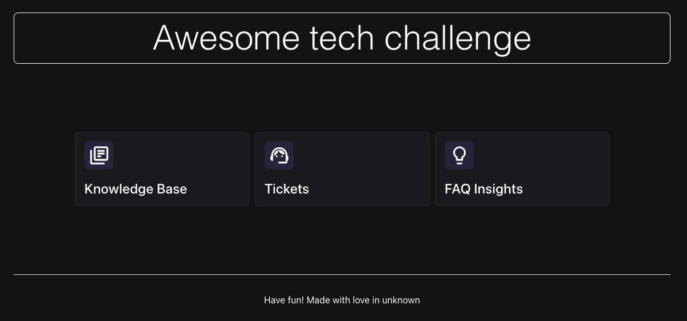
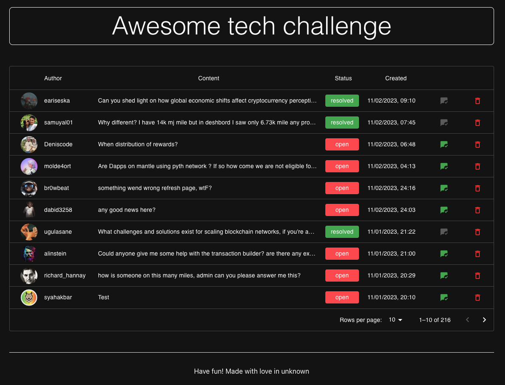
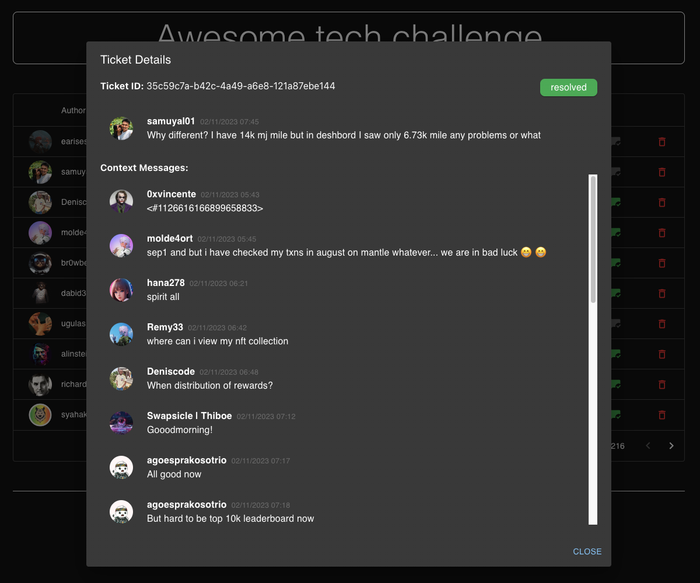

# Awesome ticket challenge

## Table of Contents
1. [Backend Setup](#backend-setup)
2. [Frontend Setup](#frontend-setup)
3. [REST API Endpoints](#rest-api-endpoints)
4. [User Interface (UI)](#user-interface-ui)
5. [Key Functionalities](#key-functionalities)
6. [UI Screenshots](#ui-screenshots)

### Backend

Steps to setup the backend environment:

1. [Download the ticket data here](https://drive.google.com/file/d/1Bvk2mW5t3GfkqTkpURiFpaLuqrUckzUX/view?usp=sharing)
2. Place it in data/awesome_tickets.json
3. Run `make setup`
4. Run `make run`
5. Try it by calling [http://localhost:5001/tickets](http://localhost:5001/tickets)

### Frontend

1. Run `make setup`
2. Run `make run`
3. Open it: [http://localhost:3002](http://localhost:3002)

## REST API Endpoints:

### 1. `/healthz` Endpoint:
- **Description:** Endpoint for checking the health of the API.
- **Response:** "OK" when the API is healthy.

### 2. `/tickets` Endpoint:
- **Description:** Retrieves a list of tickets.
- **Parameters:**
  - `limit` (int): Maximum number of tickets to retrieve.
- **Dependencies:**
  - `ticket_repo` (TicketRepository): Access to ticket data.
- **Response:** A list of tickets with details.

### 3. `/tickets/resolve` Endpoint:
- **Description:** Marks a ticket as resolved.
- **Parameters:**
  - `ticket_id` (str): ID of the ticket to resolve.
- **Dependencies:**
  - `ticket_repo` (TicketRepository): Access to ticket data.
- **Response:** The resolved ticket.

### 4. `/tickets/delete` Endpoint:
- **Description:** Removes a ticket.
- **Parameters:**
  - `ticket_id` (str): ID of the ticket to remove.
- **Dependencies:**
  - `ticket_repo` (TicketRepository): Access to ticket data.
- **Response:** The removed ticket.

### 5. `/tickets/get_messages` Endpoint:
- **Description:** Retrieves messages related to a specific ticket.
- **Parameters:**
  - `ticket_id` (str): ID of the ticket to get its messages.
- **Dependencies:**
  - `ticket_repo` (TicketRepository): Access to ticket data.
- **Response:** A list of messages for the given ticket.

## User Interface (UI):

The user interface has been designed with simplicity and functionality in mind, providing an intuitive experience for moderators. Key elements include:

### 1. Ticket List:
  - Tickets are presented in a clear and organized list format.
  - Sorting options allow moderators to arrange tickets by date or based on their status (resolved/open).
  - Status is visually represented using easily distinguishable colors for user convenience.

### 2. Ticket Actions:
  - Moderators can easily perform actions on tickets, such as resolving or deleting.
  - Actions trigger an alert dialog to ensure confirmation before proceeding.

### 3. Alert Dialog:
  - An alert dialog prompts moderators for confirmation before resolving or deleting a ticket.
  - Enhances user experience by preventing accidental actions.

### 4. Detailed Information Screen:
  - Clicking on any ticket opens a detailed information screen.
  - In the detailed information screen, crucial ticket information remains fixed at the top, ensuring it is visible even when scrolling through detailed messages.
  - This screen provides comprehensive details, including:
    - **Detailed Messages:** A section showcasing the content of the messages. 
    - **Senders' Information:** Information about the senders of the messages.
    - **Sent Date:** Timestamp indicating when the message was sent.
    - **Message URLs:** Links to the messages for direct access.
### 5. Navigation:
  - Intuitive navigation between the ticket list and detailed information screen.
  - Responsive design for a seamless experience on different devices.

## Key Functionalities:

Building upon the fundamental functionalities mentioned earlier, the system boasts additional features to enhance the moderator's experience:

- **Smart Sorting:**
  - The ticket list offers a smart sorting mechanism, allowing moderators to organize tickets by date or status (resolved/open). This feature streamlines the process of identifying and prioritizing unanswered questions.

- **Color-Coded Status Indicators:**
  - To aid quick comprehension, color-coded status indicators are implemented. Moderators can easily distinguish between resolved and open tickets, optimizing the efficiency of their workflow.

- **Efficient Ticket Removal:**
  - Moderators can swiftly remove tickets deemed unworthy of attention. The removal process triggers an alert dialog for confirmation, providing a balance between ease of use and prevention of inadvertent actions.

- **Detailed Information Accessibility:**
  - In the detailed information screen, key ticket details remain fixed at the top, even during scrolling. This ensures that essential information such as sender details, message content, discord link of corresponding message and timestamps remains readily accessible, fostering a seamless reviewing process.

- **Responsive Design:**
  - The user interface is designed to be responsive, ensuring a consistent and optimal experience across various devices. This adaptability contributes to the accessibility and usability of the system.

## UI Screenshots:

  <figure style="text-align: center">
    
    <figcaption>Home Interface</figcaption>
  </figure>

  <figure style="text-align: center">
    
    <figcaption>Tickets Interface</figcaption>
  </figure>

  <figure style="text-align: center">
    
    <figcaption>Dialog Interface</figcaption>
  </figure>

